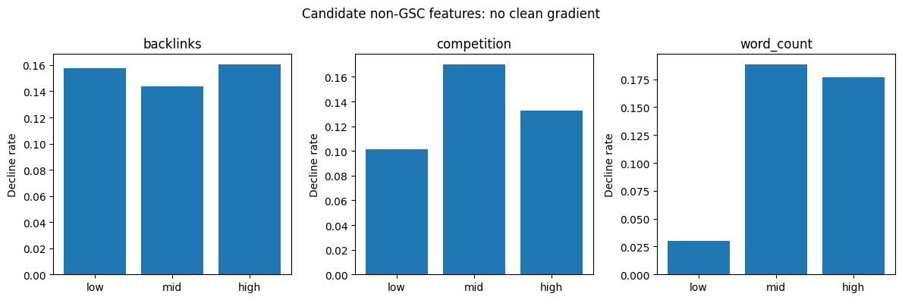
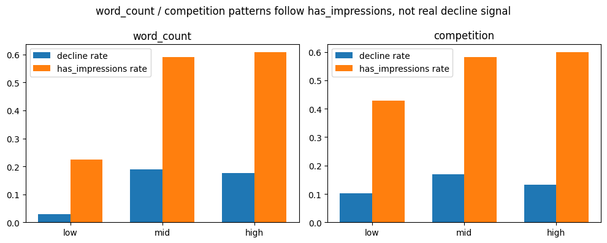
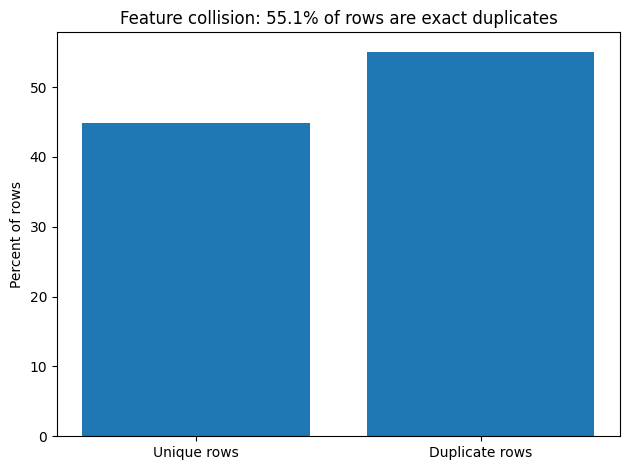
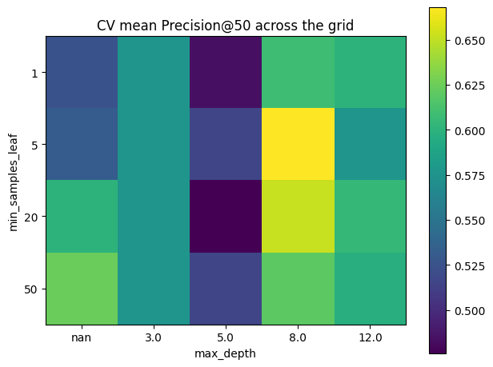
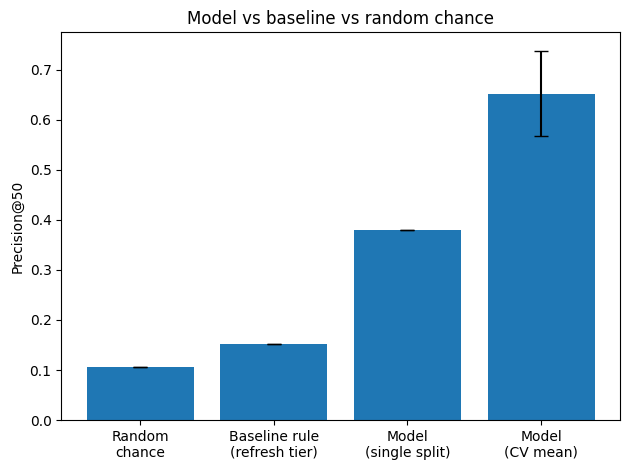
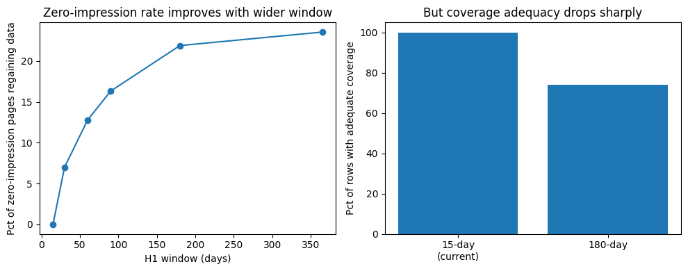
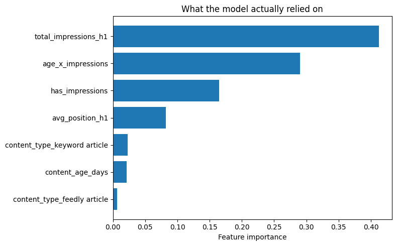
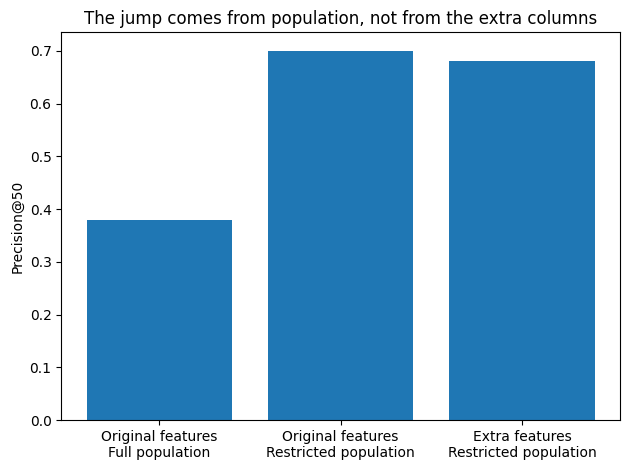

# Which pages should get refreshed first?

*Scoring content for refresh priority, and being honest about what the data can and cannot tell us.*

**Abstract:** Content teams have limited time, so the real question isn't just "is this page declining," it's "which page should get refreshed first." We built a model on FlyRank's search performance data to rank pages by refresh risk, using only signals known before the decision point. A simple rule based on page age and content type set the baseline at a refresh-tier precision of 0.153; a tuned Random Forest reached a cross-validated Precision@50 of 0.652, about 2.5 times better than the baseline on the same test split. Getting there meant finding and ruling out a false lead: adding back four excluded columns looked like it improved results, until we proved the improvement came from testing on an easier subset of pages, not from the columns themselves.

Contents

1. [Introduction](#introduction)
2. [Data](#data)
3. [Methodology](#methodology)
4. [Results](#results)
5. [Limitations & honest framing](#limitations)
6. [Ranked recommendations](#recommendations)
7. [Reproducibility](#reproducibility)
8. [Acknowledgments & data credit](#acknowledgments)

## 1. Introduction

This project helps decide which content pages should be refreshed first. The team has limited time, so they need to know which pages are likely to lose search clicks soon, before it happens. The unit of analysis is one content page for one client, looked at over one month. The output is a ranked list of pages, from most likely to decline to least likely, and an editor uses it by working down the list and refreshing the top pages first.

Getting this wrong has a real cost. If the model says a page needs refreshing but it did not actually decline, the team wastes time on it instead of a page that really needed help. If the model misses a page that is truly declining, that page keeps losing clicks with nobody noticing.

A model can help here because many things affect a page's search performance at the same time, like its age, its type, how visible it already is, and its position in search results. A simple fixed rule cannot easily combine all of these the way a model can. That is what this project tests: does a model do better than FlyRank's existing rule?

## 2. Data

We used two tables. `fact_content_daily_performance` gives daily search and site metrics for each content page, and we only used March 2026 data, split into two halves. The first half, March 1 to 15, is where we built our features, and the second half, March 16 to 31, is where we checked if clicks went up or down to build our label. `dim_content` gives static information about each page, like its creation date, content type, word count, backlinks, and competition score. We left out a few columns on purpose. We did not use `total_clicks_h1` as a feature, because a page with zero clicks can never be marked as declining under our label, no matter what else happens to it, so keeping it would let the model just learn the label's own rule instead of something real. We also left out `avg_engagement_rate_h1`, since it was missing for 84% of rows, and `search_volume`, `backlinks`, `competition`, and `word_count` were tested as possible features but not kept, which we explain in Section 3. The features we kept are `content_age_days`, `content_type`, `total_impressions_h1`, `has_impressions`, `avg_position_h1`, and one combined feature multiplying age by impressions, `age_x_impressions`.

We checked for leakage risks before trusting any of this. Our label only uses clicks from the second half of March, which comes strictly after the feature window, so there is no direct leakage there. We also checked if any pages were manually updated or optimized during our study window, since that could quietly explain a change in clicks that has nothing to do with our model, and found only 0.29% of pages updated during the first half, 0.02% during the second half, and the earliest optimization event in the whole dataset happening in April, after our study window ends. `client_hash_id` and `content_hash_id` are only used to group pages by client for our train and test split, and to join tables together, never as model features, and no client names, domains, URLs, or raw data exports appear anywhere in our files.

## 3. Methodology

### Baseline

Before building any model, we needed a simple rule to compare against, so we built one ourselves. We picked two columns, age bucket and content type, since both are known about a page right away, without needing to wait and see how it performs in search. We chose these on purpose over signals like impressions or search position, since those come from search performance itself, the same kind of information our model is being tested on, and using them in the baseline too would make the comparison less fair, since it would really just be a simpler version of what the model already does. The rule sorts every page into one of three tiers based on just these two things: **no action**, **monitor**, or **refresh**, giving us a simple starting point that any editor could understand and use without any model at all.

This rule is a fair comparison because it only uses two simple signals a person could act on the day a page is published, so beating it means our model found real value in signals that need actual search data to compute. On our test split, the refresh tier, the tier meant to flag pages needing attention, gets a precision of `0.153`, meaning about 15% of the pages it flags actually declined. Picking pages at random on the same split would give a precision of `0.106`, so the rule does a little better than random, about 1.4 times better. We also tried a second, "forced" version of the rule, sorting refresh tier pages by score and only taking the top 50, the same number our model ranks. This gives a precision of `0.26`, but this number is not really fair to trust, because **11,176** pages tie for the exact same top score, so taking "the top 50" out of 11,000+ tied pages is really just picking 50 pages at random from that group. We only show this number for comparison, not as a real result.

### Model

We used a Random Forest classifier, since it can combine several signals together and find patterns that a simple rule cannot. Our final features are `content_age_days`, `content_type`, `total_impressions_h1`, `has_impressions`, `avg_position_h1`, and one combined feature, `age_x_impressions`, made by multiplying age and impressions together. We picked this combination after testing it against a version without it and a version with a second interaction feature, and this one gave the best result on its own. Our label, `is_declining`, marks a page as 1 if its daily click rate in the second half of March was lower than its daily click rate in the first half, and 0 otherwise.

We tested four other columns as possible features and left all of them out. `search_volume` showed no clear pattern between its buckets. `backlinks` was missing for over half the rows and also showed no clear pattern. `competition` and `word_count` both looked promising at first, each showing what seemed like a real pattern across their buckets, but when we checked closer, both patterns matched almost exactly with which pages had any search impressions at all. In other words, these two columns were not actually predicting decline, they were just standing in for whether a page had impressions, something we already capture directly with `has_impressions`. Since we already have that signal from a cleaner source, we left both out.

The biggest challenge we found is that 55.1% of all rows share the exact same values across our five kept features, meaning the model sees many pages that look completely identical to each other on paper. Most of this comes from pages with zero search impressions, since they all get the same filled in average position value, collapsing them into indistinguishable rows. No model can rank two identical looking rows differently, so this sets a real ceiling on how well any model, ours included, can do on this data.

## 4. Results

### Evaluation

We split our data by client, not randomly by row, since pages from the same client tend to behave in similar ways. If we split randomly, the model could see pages from a client in training and then get tested on other pages from that same client, making the test look easier than it really is. Our split gives 41 clients for training and 11 for testing, with no overlap between the two groups.

Since a single test split can bounce around by chance, especially with only 52 clients total, we also ran a 5-fold cross validation, where we split the clients into 5 different groups and tested on each group in turn. We used this cross validation to search across different model settings, testing 20 combinations of tree depth and leaf size, and picked the setting with the best balance of a high average score and a low spread across folds. Our chosen setting reached a cross validation average precision of `0.652`, with a spread of `0.085` across folds. On our held out test split, the model reaches a precision of `0.38` in its top 50 ranked pages, compared to `0.153` for our baseline rule and `0.106` for picking pages at random, meaning the model is about 2.5 times better than the baseline rule and about 3.6 times better than random guessing on the same test data and metric. We rely more on the cross validation average of 0.652 than on this single test number, since we already know single splits can move around quite a bit with this small a client pool.

A natural question here is whether widening our study window would help by adding more clients to train and test on. It would not, since client count only grows because FlyRank keeps onboarding new clients over time, so looking further back in time means fewer clients existed back then, not more. We did test widening the window itself, from 15 days up to 365 days, and this does reduce the zero impression problem by about 12 points. But it comes with a coverage tradeoff: at a 180 day window, only 4.3% of rows actually have the full 180 days of history available, since many clients were not FlyRank clients that far back. So a wider window trades one data problem for another, rather than fixing it outright.

### Interpretation

We looked at feature importance to see what the model actually relied on. `total_impressions_h1` mattered the most by far, followed closely by `age_x_impressions`, our combined feature multiplying age and impressions. `has_impressions` and `avg_position_h1` mattered some, but much less. `content_age_days` on its own barely mattered at all, even though it looked useful in our early bucket checks. This tells us the model leans almost entirely on how much search traffic a page already gets, not on how old it is or what type it is.

Our real surprise happened late, after building the model, and it fooled us for a moment before we caught it. We wondered if adding back the columns we had excluded, `search_volume`, `backlinks`, `word_count`, and `competition`, would help, since maybe together they held more signal than each did alone. When we trained a model with these four columns added, precision at 50 jumped from `0.38` to `0.68`, which looked like a real, exciting improvement at first. But we noticed these four columns have missing values for a lot of pages, so testing this meant dropping any page missing even one of them, leaving only 113,463 rows out of our original 302,692. This smaller group turned out to have a much higher rate of pages with real search impressions, 56.2% compared to 47.8% in the full data, meaning it was simply an easier group of pages to predict on. To check this, we trained our original model, with none of the extra columns, on that same restricted group, and it also jumped, to `0.70`, even higher than the version with the extra columns added. The surprise was this: the improvement had nothing to do with the four columns at all. It came entirely from testing on an easier slice of pages. This is a clean negative result, since we now have proof the columns do not help, instead of just a guess.

## 5. Limitations & honest framing

- **Feature collision.** More than half our pages, 55.1%, look exactly the same to the model because we are missing real search data for them. This is why they end up in a separate manual-audit track instead of being ranked, and it sets a real ceiling on what any model can do here.
- **Small client pool.** We only had 52 clients to learn from, so every number in this report carries real sampling uncertainty. Our cross validation spread, `0.085`, shows how much results can shift just from one group of clients to another.
- **Metric granularity.** Our main score only moves in small steps of 0.02, and 14 of the 20 model settings we tested landed within 0.1 of the best one. Small differences between settings, or between single test runs, should not be read as one being clearly better than another.
- **Decision-support, not causal.** A high score means a page resembles past decliners on the signals we observed. It does not mean refreshing the page will cause its performance to recover, that would need a controlled experiment this data cannot provide.
- **No algorithmic claims.** Nothing here proves anything about how Google's search algorithm actually works, only what patterns are observable in this data.

## 6. Ranked recommendations

The model gives editors a ranked list to start from, not a final answer. Every page in our test set falls into one of two groups. Pages that already show up in search get ranked by how risky they look, and each one gets a short reason so an editor knows what to check first: `high_traffic_at_risk` means the page already gets a lot of traffic and we do not want to lose it (8,205 pages), `poor_ranking_position` means it is already ranking badly (5,385 pages), `aging_content_risk` means it is old (2,257 pages), and `declining_search_signal` covers the rest the model still flagged (8,762 pages). The top 50 riskiest pages get marked `refresh_priority`, the next 150 get `monitor`. Pages that never show up in search at all (28,638 of them) go into a separate pile called `manual_content_audit`, since the model simply has nothing to judge them on.

We would tell an editor to treat this list as a helpful starting point, not a strict order to follow blindly. It is safer to trust that the whole group of top pages is more likely to be declining, about 2.5 times more than our simple rule, than to trust the exact order of any single page.

## 7. Reproducibility

To run this again from scratch:

- Clone the repo and open `capstone.ipynb` locally, in Jupyter or VS Code.
- Create a `.env` file in the project folder with one line: `HF_TOKEN=your_huggingface_token_here`.
- Install dependencies with `pip install -r requirements.txt`, then run every cell from top to bottom, in order. Data loads straight from Hugging Face through `duckdb`, no manual downloads needed.
- `random_state=42` is used everywhere a random choice happens, in the train/test split and in every model trained, so results should match run to run.
- One fix worth knowing: an early version gave slightly different results depending on the machine, from tiny floating point differences in one calculated column. We fixed this by rounding that column to 6 decimal places right after computing it, which made results stable across different runs.

## 8. Acknowledgments & data credit

Built on the FlyRank ML Internship dataset, [flyrank.ai](https://flyrank.ai).

Abdelrhman Moubarak · FlyRank AI Internship, Machine Learning track
